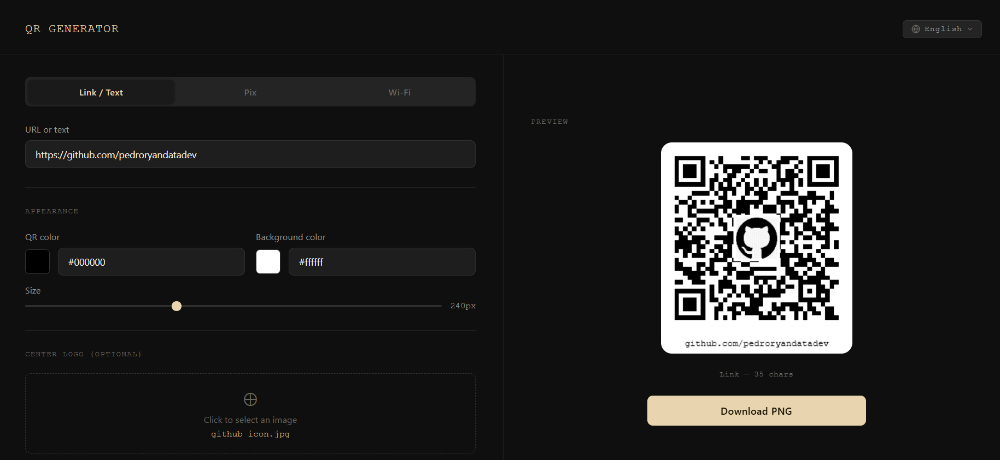
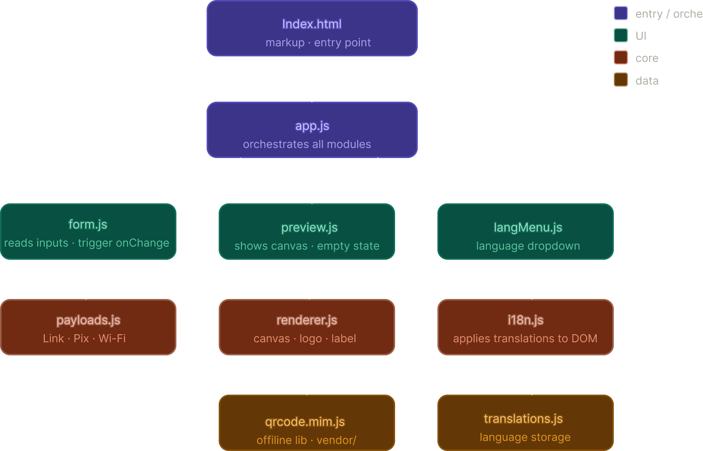

<h1 align="center">QR Generator</h1>

The goal of this project is to create QR Codes in a practical way by simply filling out a form, with the ability to see the result instantly and scan it with your phone before downloading.

The project supports three types of QR Code: Link to direct anyone to a website, Pix to receive payments through Brazil's instant payment system — the payer just scans the code with their banking app, and Wi-Fi to connect devices to a network without typing the password.

You can also customize each QR Code with colors, size, add your brand logo in the center, and a text label below the image.

> [!IMPORTANT]
> Pix is a payment system exclusive to Brazil. QR Codes generated in this format only work with Brazilian banking apps.

<p align="center">
  
</p>

# Features

- **Link/Text:** any URL or free text content
- **Pix:** valid BR Code payload with CRC-16/CCITT, compatible with all Brazilian payment apps
- **Wi-Fi:** format natively recognized by iOS and Android readers
- Live preview as the form is filled in
- QR color, background color, and size customization
- Centered logo with size control
- Text label below the QR Code
- PNG download with padding and label included
- Interface available in English and Portuguese

# Architecture

The project follows a layered architecture, organized into four levels where each one has a single responsibility and depends only on the layer below it.

<p align="center">
  
</p>

**Entry/Orchestration:** `index.html` is pure markup with no logic. `app.js` is the only file that knows all modules and defines the main flow: form changed → build payload → render canvas → display in preview.

**UI:** three controllers that only interact with the DOM. `form.js` reads inputs and fires `onChange` to `app.js` when something changes. `preview.js` receives a ready canvas and handles displaying, hiding, or showing an error state. `langMenu.js` controls the language dropdown and delegates to `i18n.js` when a language is selected.

**Core:** pure logic, no DOM access. `payloads.js` receives strings and returns the correct payload for each type (Link, Pix with CRC-16, Wi-Fi). `renderer.js` receives data and returns a composed `HTMLCanvasElement` with QR + padding + logo + label — this canvas is the single source of truth for both preview and download. `i18n.js` maintains the language map and applies translations via `data-i18n` attributes in the DOM.

**Data:** two static data sources. `translations.js` is a single object containing all languages. `qrcode.min.js` is a third-party library kept in `vendor/`, offline, with no CDN dependency.

> To learn more about layered architecture, see the article by [Martin Fowler](https://martinfowler.com/bliki/PresentationDomainDataLayering.html)

## Pix payload

The Pix QR Code follows the **BR Code / EMVCo Merchant Presented QR** standard, defined by the Brazilian Central Bank.

| Field | Description | Value |
|-------|-------------|-------|
| `00` | Payload Format Indicator | `01` |
| `01` | Point of Initiation Method | `11` (static, immediate payment) |
| `26` | Merchant Account Info | GUI + Pix key |
| `52` | Merchant Category Code | `0000` |
| `53` | Transaction Currency | `986` (BRL) |
| `54` | Transaction Amount | provided value (optional) |
| `58` | Country Code | `BR` |
| `59` | Merchant Name | `RECEBEDOR` |
| `60` | Merchant City | `BRASIL` |
| `62` | Additional Data | Reference Label `***` |
| `63` | CRC | CRC-16/CCITT calculated over the full payload |

Field `01 = 11` is what signals immediate payment. Field `59` (merchant name) is automatically replaced by the payment app with the real account name, fetched from the Central Bank API using the provided key.

When present, the amount is treated as a suggestion. The static BR Code standard does not support locking the amount universally — that would require Pix Cobrança (dynamic QR via a PSP API).

## Adding a new language

All strings live in `js/translations.js`. To add a new language, push a new object into the `languages` array following the existing pattern:

```js
{
  code:  'es',
  label: 'Español',
  flag:  '🇪🇸',
  strings: {
    tab_link: 'Enlace / Texto',
    tab_pix:  'Pix',
    // ... remaining keys
  }
}
```

No other file needs to be changed.

## Usage

Open `index.html` directly in your browser. No server needed.

```
Double-click index.html
```

## Dependencies

| Library | Version | Purpose |
|---------|---------|---------|
| [QRCode.js](https://github.com/davidshimjs/qrcodejs) | 1.0.0 | QR Code generation on canvas |

No other dependencies. The library is bundled in `vendor/` and stored locally within the project, requiring no external connection and avoiding any future availability concerns.

## Credits

QR Code generation powered by [QRCode.js](https://github.com/davidshimjs/qrcodejs), created by [Sangmin Shim (davidshimjs)](https://github.com/davidshimjs) and contributors, distributed under the MIT license.

## License

```
Development in 2026 by pedroryandatadev

This project is licensed under the MIT License. See the LICENSE file for more information.
```